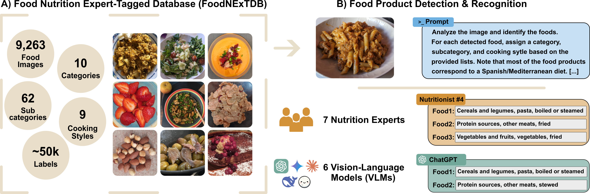

# FoodNExTDB 🍽️  

### Article 📄: [Are Vision-Language Models Ready for Dietary Assessment? Exploring the Next Frontier in AI-Powered Food Image Recognition](https://arxiv.org/abs/2504.06925)

## 🗂️ Dataset Access

📌 **The FoodNExTDB dataset will be made publicly available soon.**  
Stay tuned for the release and citation guidelines.

**The FoodNExTDB database will only be used for research purposes and will not be used nor included in commercial applications in any form (e.g., original files, encrypted files, files containing extracted features, etc).**

<!--**The Database will only be used for research purposes and will not be used nor included in commercial applications in any form (e.g., original files, encrypted files, files containing extracted features, etc).**-->


---



## 📌 Introduction

**This repository hosts the FoodNExTDB dataset and materials from our study evaluating Vision-Language Models (VLMs) for food image recognition.**

**FoodNExTDB** is a new expert-labeled food image database developed to evaluate the capabilities of VLMs in automatic dietary assessment tasks. The **FoodNExTDB** is a food image database derived from the [AI4FoodDB](https://github.com/AI4Food/AI4FoodDB) [[1]](https://academic.oup.com/database/article/doi/10.1093/database/baad049/7226275), a **comprehensive multimodal database acquired from a one-month randomized controlled trial (RCT) with 100 overweight and obese participants undergoing a nutritional intervention**. The FoodNExtdb includes food images collected over 14 days per participant, featuring many food products representative of Spanish and Mediterranean cuisine (Dataset DS3 - Nutrition).

In our paper titled "**Are Vision-Language Models Ready for Dietary Assessment? Exploring the Next Frontier in AI-Powered Food Image Recognition**", accepted at **CVPR 2025 Workshops** (see the full paper on [arXiv](https://arxiv.org/abs/2504.06925)), we assess six state-of-the-art VLMs (ChatGPT, Gemini, Claude, Moondream, DeepSeek, and LLaVA) on their ability to recognize food items at different semantic levels — including food category (e.g., *protein source*), subcategory (e.g., *poultry*), and cooking style (e.g., *grilled*).

The database consists of:

- **9,263 food images**  
- **10 high-level food categories**  
- **62 fine-grained subcategories**  
- **9 cooking styles**  
- **50,000+ expert-generated annotations**, verified by seven nutrition professionals

This dataset contains food and drink images collected during a ~14-day digital intervention, where participants documented their dietary intake by uploading pictures via a dedicated web platform. **Food images for each participant are stored in their respective folders. Each image is named using the format A4F_XXXXX_YYYY.jpg, where A4F_XXXXX corresponds to the Anonymized Participant ID, and YYYY indicates the image number. Each participant also has an associated CSV file named A4F_XXXXX_timestamps.csv, which contains a timestamp column indicating when each photo was taken, and another CSV file named A4F_XXXXX_labeled_data.csv, which includes the corresponding labels.**

**NOTE: We include an example in the folder [example_data](https://github.com/AI4Food/FoodNExtDB/tree/main/example_data), which contains an image along with its corresponding timestamp and label files.**

#### Timestamps

A separate CSV file is provided for each participant, recording the timestamp corresponding to each image. These files enable temporal analysis of dietary patterns throughout the intervention.

For each participant, a CSV file named `A4F_XXXXX_timestamps.csv` provides detailed information about when each food image was captured. This file contains three variables:

-   `id`: **Image ID** in the format `A4F_XXXXX_YYYY.jpg`, where `A4F_XXXXX` corresponds to the **Anonymized Participant ID**, and `YYYY` is the **image number**.
    
-   `timestamp`: **Timestamp of the photo**, in the format `YYYY-MM-DD HH:MM:SS+Z`.
    
-   `original_timestamp_validity`: A boolean indicating whether the timestamp reflects the **actual time the photo was taken** (`True`) or the **time it was uploaded to the platform** (`False`).

  The `timestamp` value is considered reliable only if `original_timestamp_validity` is set to `True`. Otherwise, it may not correspond to the real moment of food consumption, as it reflects the upload time instead.

#### Labels

Food images have been manually annotated with semantic labels to identify food types, ingredients, and preparation methods. These labels are provided in individual CSV files per participant. 

Labels for each image are stored in a separate file named `A4F_XXXXX_labeled_data.csv`, detailing the semantic annotation of food items. The labeling file includes the following variables:


-   `id`: **Image ID** in the format `A4F_XXXXX_YYYY.jpg`, where `A4F_XXXXX` corresponds to the **Anonymized Participant ID**, and `YYYY` is the **image number**.
    
-   `id_labeler`: **Labeler ID** who annotated the image.
    
-   `category`: **Main food category** assigned to the item (e.g., vegetables and fruits, protein source, fast food).
    
-   `subcategory`: **Specific food subcategory** (e.g., fruits, poultry, pizza).
    
-   `cooking_style`: **Preparation or cooking method** used (e.g., grilled, raw, boiled).


## References

[1] [S. Romero-Tapiador, B. Lacruz-Pleguezuelos, R. Tolosana, et al. AI4FoodDB: A Database for Personalized e-Health Nutrition and Lifestyle through Wearable Devices and Artificial Intelligence. Database, 2023: baad049, 2023](https://academic.oup.com/database/article/doi/10.1093/database/baad049/7226275).


---

## 📄 Citation

**Any work made public, whatever the form, based directly or indirectly on any part of the FoodNExTDB database will include the following references:**

- S. Romero-Tapiador,  R. Tolosana, B. Lacruz-Pleguezuelos, L. J. Marcos-Zambrano, Guadalupe X. Bazán, I. Espinosa-Salinas, J. Fierrez, J. Ortega-Garcia,  E. Carrillo de Santa Pau, and A. Morales., “Are Vision-Language Models Ready for Dietary Assessment? Exploring the Next Frontier in AI-Powered Food Image Recognition”, In Proc. IEEE/CVF Conference on Computer Vision and Pattern Recognition Workshops, 2025.

```bibtex
@inproceedings{romerotapiador2025foodnextdb,
  title     = {Are Vision-Language Models Ready for Dietary Assessment? Exploring the Next Frontier in AI-Powered Food Image Recognition},
  author    = {Sergio Romero-Tapiador and Ruben Tolosana and Blanca Lacruz-Pleguezuelos and Laura Judith Marcos-Zambrano and Guadalupe X. Bazán and Isabel Espinosa-Salinas and Julian Fierrez and Javier Ortega-Garcia and Enrique Carrillo de Santa Pau and Aythami Morales},
  booktitle = {In Proc. IEEE/CVF Conference on Computer Vision and Pattern Recognition Workshops},
  year      = {2025}
}
```
---

## Contact
If you have any questions, please get in touch with us at sergio.romero@uam.es or ruben.tolosana@uam.es.
