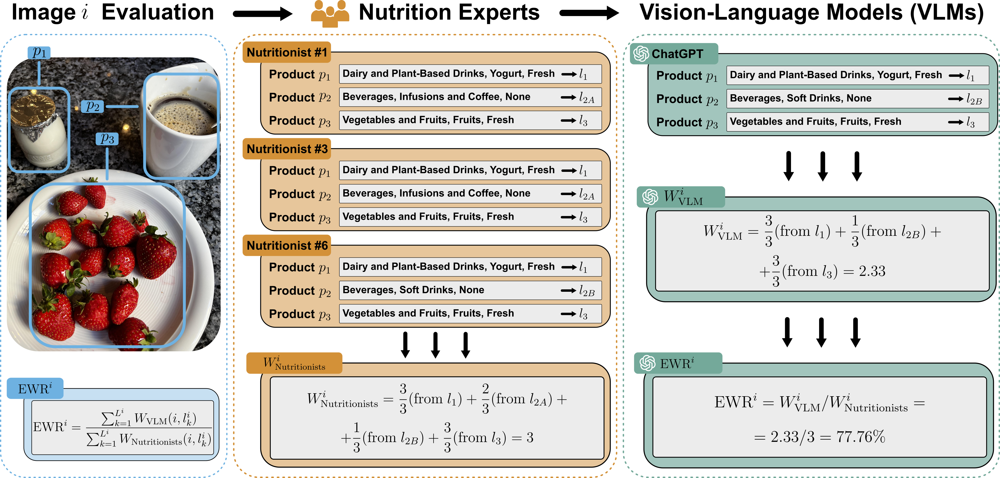

# FoodNExTDB 🍽️  

This repository hosts the FoodNExTDB dataset and materials from our study evaluating Vision-Language Models (VLMs) for food image recognition. The dataset will be publicly available soon.

---


## 📌 Introduction

**FoodNExTDB** is a new expert-labeled food image database developed to evaluate the capabilities of VLMs in automatic dietary assessment tasks. The **FoodNExTDB** is a food image database derived from the [AI4FoodDB](https://github.com/AI4Food/AI4FoodDB) [[1]](https://academic.oup.com/database/article/doi/10.1093/database/baad049/7226275), a **comprehensive multimodal database acquired from a one-month randomized controlled trial (RCT) with 100 overweight and obese participants undergoing a nutritional intervention**. The FoodNExtdb includes food images collected over 14 days per participant, with many food products reflecting Spanish and Mediterranean cuisine characteristics.

In our paper titled "**Are Vision-Language Models Ready for Dietary Assessment? Exploring the Next Frontier in AI-Powered Food Image Recognition**", accepted at **CVPR 2025 Workshops** (see the full paper on [arXiv](https://arxiv.org/abs/2504.06925)), we assess six state-of-the-art VLMs (ChatGPT, Gemini, Claude, Moondream, DeepSeek, and LLaVA) on their ability to recognize food items at different semantic levels — including food category (e.g., *protein source*), subcategory (e.g., *poultry*), and cooking style (e.g., *grilled*).

The database consists of:

- **9,263 food images**  
- **10 high-level food categories**  
- **62 fine-grained subcategories**  
- **9 cooking styles**  
- **50,000+ expert-generated annotations**, verified by seven nutrition professionals

## 📏 Expert-Weighted Recall (EWR)

We also introduce **Expert-Weighted Recall (EWR)**, a new metric that evaluates how well Vision-Language Models (VLMs) match expert annotations and considers inter-annotator variability.

In each image *i*, experts identify multiple food products. Let:

- $p_j^i$ be the *j-th* product in image *i*, with $j = 1,...,M^i$.
- $l_k^i$ be the *k-th* label assigned across all products in image *i*, with $k = 1,...,L^i$.
- $n_k^i$ be the number of nutritionists who assigned label $l_k^i$.
- $N^i$ be the total number of annotators for image *i*.

Each label is weighted based on expert agreement:

```math
W_{Nutritionists}(i, l_k^i) = {n_k^i \over N^i}
```

For VLM predictions:

- If the predicted label matches an expert annotation:  
```math
  W_{VLM}(i, l_k^i) = {{n_k^i} \over N^i}
```
- If the predicted label does not match any annotation:  
  ```math
  W_{VLM}(i, l_k^i) = 0
  ```

Finally, the **EWR** for image *i* is calculated as:

```math
EWR^i = {{\sum_{k=1}^{L^i} W_{VLM}(i, l_k^i)} \over {\sum_{k=1}^{L^i} W_{Nutritionists}(i, l_k^i)}}
```

The final **EWR** score is obtained by averaging the individual EWRⁱ values across all images. This metric ensures that predictions with higher expert agreement contribute more to the final score, while still allowing partial agreement to be reflected.

As illustrated in the example below, three food products are detected in a given food image *i*: `p1`, `p2`, and `p3`.  
- All experts agreed on `p1` with the label *"yogurt"*.
- `p2` was labeled differently by two experts.
- All experts identified `p3` as *"fruits"*.

ChatGPT correctly predicted the label for `p1`, matched one of the expert labels for `p2`, and also predicted the correct label for `p3`.

The resulting EWR of **77.76%** reflects how well ChatGPT aligns with expert annotations, taking into account the variability among nutritionists.




## References

[1] [S. Romero-Tapiador, B. Lacruz-Pleguezuelos, R. Tolosana, et al. AI4FoodDB: A Database for Personalized e-Health Nutrition and Lifestyle through Wearable Devices and Artificial Intelligence. Database, 2023: baad049, 2023](https://academic.oup.com/database/article/doi/10.1093/database/baad049/7226275).

---

## 🗂️ Dataset Access

📌 **The FoodNExTDB dataset will be made publicly available soon.**  
Stay tuned for the release and citation guidelines.

---

## 📄 Citation

If you use this database or the evaluation protocol, please cite:

```bibtex
@inproceedings{romerotapiador2025foodnextdb,
  title     = {Are Vision-Language Models Ready for Dietary Assessment? Exploring the Next Frontier in AI-Powered Food Image Recognition},
  author    = {Sergio Romero-Tapiador and Ruben Tolosana and Blanca Lacruz-Pleguezuelos and Laura Judith Marcos-Zambrano and Guadalupe X. Bazán and Isabel Espinosa-Salinas and Julian Fierrez and Javier Ortega-Garcia and Enrique Carrillo de Santa Pau and Aythami Morales},
  booktitle = {In Proc. of the IEEE/CVF Conference on Computer Vision and Pattern Recognition workshops},
  year      = {2025}
}
```
---

## Contact
If you have any questions, please get in touch with us at sergio.romero@uam.es.
